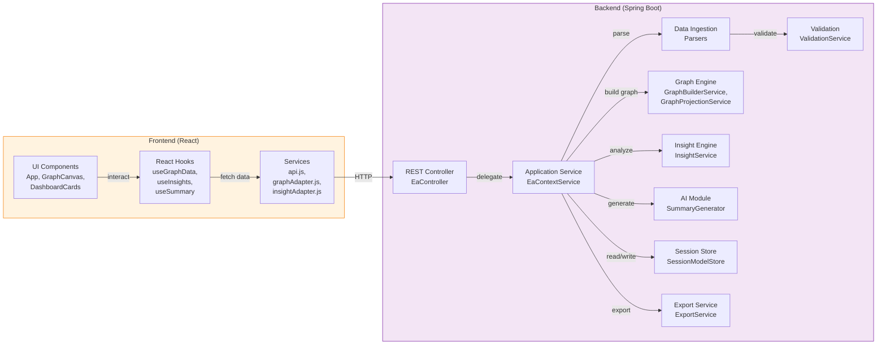
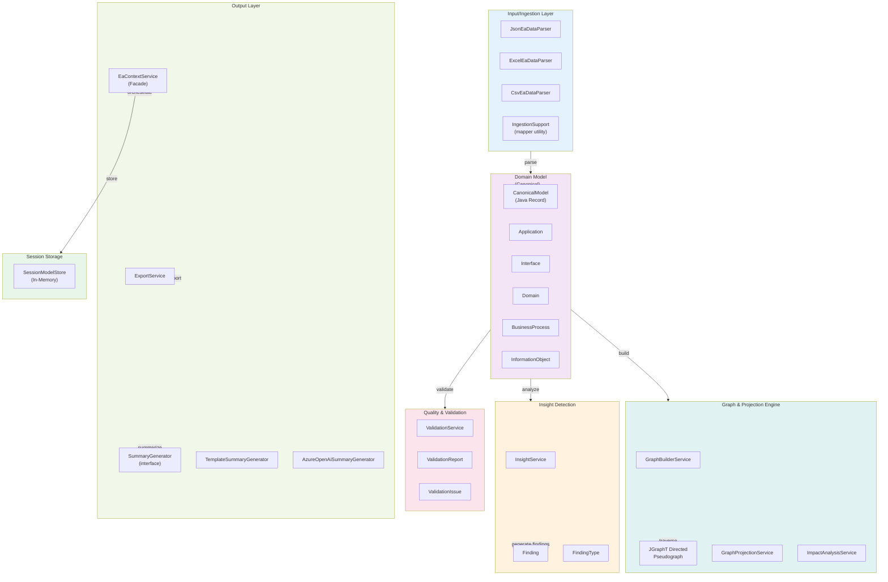
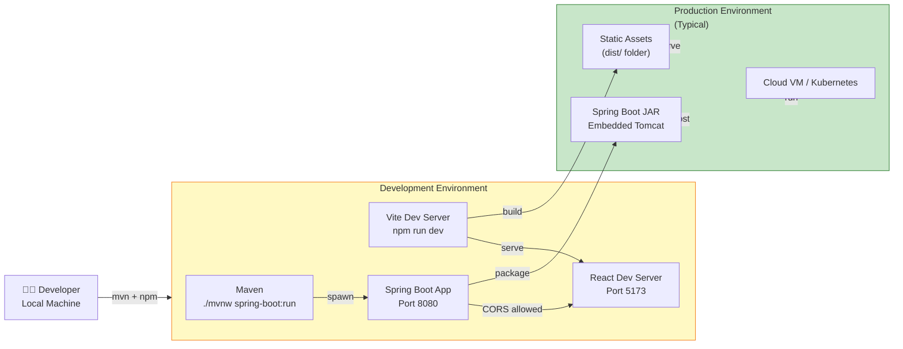
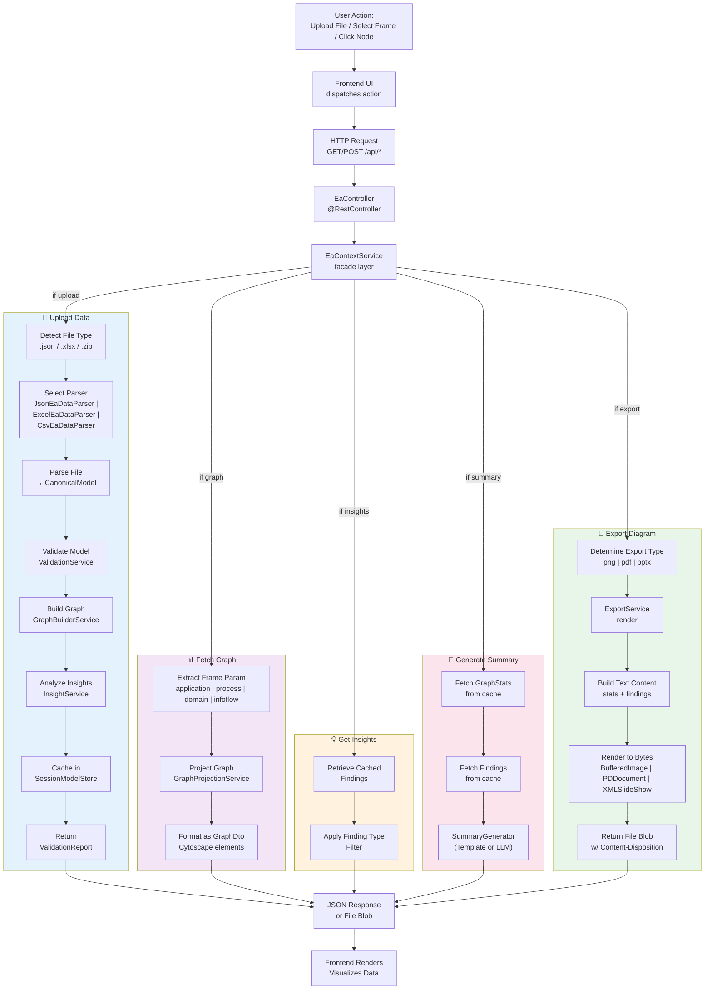

# Context Cartography: Architecture & Technical Design Document

**Version:** 0.0.1  
**Last Updated:** September 2026  
**Project Type:** Spring Boot 3 + React 19  
**Status:** Production-Ready

---

## Table of Contents
1. [Executive Overview](#executive-overview)
2. [High-Level Architecture](#high-level-architecture)
3. [Project Structure Analysis](#project-structure-analysis)
4. [File Inventory](#file-inventory)
5. [Technology Stack & Dependencies](#technology-stack--dependencies)
6. [Data Flow & Processing Pipeline](#data-flow--processing-pipeline)
7. [API Specifications](#api-specifications)

---

## Executive Overview

### Purpose
Context Cartography is an **AI-Powered Enterprise Architecture (EA) Context Diagram Generator & Insight Engine**. It ingests EA datasets in multiple formats, builds dependency graphs, detects architectural issues, and provides both visual and programmatic access to enterprise application landscapes.

### Business Problem Solved
Organizations struggle to maintain an accurate, current view of their enterprise IT landscape:
- **Application Proliferation**: Hundreds or thousands of applications with unclear relationships
- **Integration Complexity**: Undocumented or poorly tracked interfaces between systems
- **Architectural Debt**: No automated way to identify risk patterns (EOL systems, hotspots, ownership gaps)
- **Stakeholder Communication**: Difficulty conveying landscape context to non-technical executives and architects
- **Change Impact Analysis**: Manual, error-prone assessment of how changes cascade through dependencies

### Key Capabilities

#### Data Ingestion
- **Multi-format support**: JSON, Excel (.xlsx), CSV (ZIP-bundled)
- **Pluggable parsers**: Technology-agnostic, config-driven column mapping
- **Format-agnostic canonical model**: Unified internal representation regardless of source

#### Data Quality & Validation
- **Required fields enforcement**: Every entity must have id and name
- **Unique ID enforcement**: No duplicate IDs within entity types
- **Referential integrity checks**: Interface providers/consumers must reference real applications
- **Completeness warnings**: Missing owner assignments, orphan interfaces, unmapped processes
- **Non-blocking validation**: Issues logged but don't prevent ingestion (data quality scores reported to frontend)

#### Graph Analysis Engine
- **Directed pseudograph construction**: Apps as vertices, interfaces as edges
- **Multi-view projections**: Four observation frames for different stakeholder views
  - **Application View**: Raw app-to-app dependency network
  - **Business Process View**: Apps grouped by business processes
  - **Domain View**: Applications aggregated by business/architecture domains
  - **Information Flow View**: Data object exchanges between applications
- **Impact Analysis**: Blast radius computation (upstream suppliers + downstream consumers)
- **JGraphT Integration**: Leverages mature, production-grade graph algorithms

#### Architectural Insight Detection
Automated detectors identify high-risk patterns:
- **Ownership Gaps**: Applications without assigned owners
- **Orphan Interfaces**: Interfaces without consumer applications
- **Missing Process Mappings**: Applications not linked to business processes
- **Lifecycle Risks**: EOL or deprecated systems creating technical debt
- **Dependency Hotspots**: Applications with excessive connections (single points of failure)

#### AI-Powered Summarization
- **Template-based default**: Deterministic natural-language summary generation (no external dependencies)
- **Azure OpenAI integration (optional)**: Pluggable LLM backend with graceful fallback
- **Configurable via Spring profiles**: `ai` profile activates when environment variables set

#### Export Capabilities
- **PNG export**: Visual summary suitable for presentations
- **PDF export**: Shareable static format for archives and distribution
- **PPTX export**: PowerPoint-ready slide with landscape summary and top findings

### Target Users

| User Persona | Use Cases | Needs |
|---|---|---|
| **Enterprise Architect** | Strategic planning, roadmap alignment | System relationships, legacy risk, dependency patterns |
| **Technical Lead** | Impact analysis, change management | Blast radius queries, dependent systems identification |
| **Operations Manager** | Capacity planning, SLA management | Application hotspots, integration complexity metrics |
| **Portfolio Manager** | Portfolio optimization, rationalization | Application inventory, process mappings, ownership accountability |
| **IT Compliance Officer** | Risk & audit reporting | Lifecycle status tracking, owner assignment validation |
| **Dashboard Consumer (Executive)** | Business context, system health | Summarized landscape view, top risks, metric trends |

### Technology Stack

#### Backend
- **Framework**: Spring Boot 3.3.5 (Java 21+)
- **Server**: Tomcat (Spring MVC)
- **HTTP Client**: Spring WebFlux WebClient (async for LLM calls)
- **Graph Processing**: JGraphT 1.5.2 (directed pseudograph, algorithms)
- **Data Format Processing**:
  - JSON: Jackson (ObjectMapper)
  - Excel: Apache POI 5.3.0 (OOXML support)
  - CSV: Apache Commons CSV 1.12.0
- **Export Formats**:
  - PNG/JPEG: Java AWT/ImageIO
  - PDF: Apache PDFBox 3.0.3
  - PPTX: Apache POI 5.3.0
- **Build Tool**: Maven 3.x (with bundled mvnw/mvnw.cmd)
- **Dependency Injection**: Spring Framework annotations
- **Validation**: Jakarta Validation (Hibernate Validator)
- **Logging**: SLF4J (Spring Boot default)
- **Testing**: Spring Boot Test, JUnit 5
- **Code Simplification**: Lombok (annotation processor)

#### Frontend
- **Framework**: React 19.2.8 with Hooks
- **Build Tool**: Vite 8.2.2 (fast dev server, optimized builds)
- **HTTP Client**: Axios 1.20.0 (RESTful API communication)
- **Graph Visualization**: Cytoscape.js 3.34.3 with FCose layout
- **SVG Export**: cytoscape-svg 0.4.0
- **Icon Library**: Lucide React 1.43.0 (modern, accessible SVG icons)
- **PDF Generation**: jsPDF 4.2.1 (client-side PDF export)
- **CSS**: Plain CSS modules (no build-time preprocessor)
- **Linting**: ESLint 10.9.0 with React plugin

#### DevOps & Infrastructure
- **Local Development**: Maven dev server + Vite HMR
- **CORS**: Configured for Vite dev origin (`http://localhost:5173`)
- **In-Memory Storage**: Session-scoped (no persistent database)
- **Sample Data**: Auto-loaded on startup (configurable)
- **Profiles**: Spring `ai` profile for optional LLM integration

---

## High-Level Architecture

### System Architecture Diagram

```mermaid
graph TB
    User["👤 User<br/>(Browser)"]
    Frontend["🎨 React Frontend<br/>Vite + Cytoscape.js"]
    Backend["⚙️ Spring Boot Backend<br/>Java 21"]
    Storage["💾 In-Memory Session<br/>Store (No DB)"]
    LLM["🤖 Azure OpenAI<br/>(Optional)"]
    
    User -->|HTTP/REST| Frontend
    Frontend -->|Axios REST API<br/>/api/*| Backend
    Backend -->|Read/Write| Storage
    Backend -->|Async WebClient<br/>summarize()| LLM
    LLM -->|Natural Language<br/>Summary| Backend
    
    style User fill:#e1f5ff
    style Frontend fill:#fff3e0
    style Backend fill:#f3e5f5
    style Storage fill:#e8f5e9
    style LLM fill:#fce4ec
```

### Application Architecture Diagram



### Component Architecture Diagram



### Deployment Architecture Diagram



### Request Processing Flow Diagram



---

## Project Structure Analysis

### Backend Source Code Structure (`src/main/java/com/vw/eacontext/`)

#### 📁 **Root Package: `com.vw.eacontext`**

**Purpose:**  
Main application entry point and high-level package organization

**Contains:**
- `EaContextApplication.java` — Spring Boot application class with `@SpringBootApplication` and `@ConfigurationPropertiesScan`

**Interactions:**
- Instantiated by Spring Boot runtime
- Triggers component scanning for all sub-packages
- Enables configuration property binding

**Responsibilities:**
- Application startup orchestration
- Component discovery and initialization

---

#### 📁 **`model/` Package**

**Purpose:**  
Canonical domain model representing the Enterprise Architecture universe — technology-agnostic, immutable Java records

**Contains:**

| File | Purpose |
|------|---------|
| `CanonicalModel.java` | Root container holding all parsed entities (domains, processes, apps, interfaces, info objects). Java record with defensive copying. |
| `Application.java` | System/application entity. Fields: `id`, `name`, `owner`, `domain`, `lifecycleStatus`, `techStack`, `processId`. |
| `Interface.java` | Integration/data exchange between applications. Fields: `id`, `name`, `providerId`, `consumerId`, `type`, `dataObject`. |
| `Domain.java` | Business/architecture domain grouping applications. Fields: `id`, `name`. |
| `BusinessProcess.java` | Business process supporting applications. Fields: `id`, `name`, `domainId`. |
| `InformationObject.java` | Data/information object exchanged via interfaces. Fields: `id`, `name`. |
| `LifecycleStatus.java` | Enum: `ACTIVE`, `DEPRECATED`, `EOL`, `PLANNED`. |
| `InterfaceType.java` | Enum: protocol/integration type (e.g., `REST`, `SOAP`, `DATABASE`, `MESSAGING`). |

**Interactions:**
- Ingestion layer → parses source data into model records
- Validation layer → inspects for data quality issues
- Graph layer → consumes to build JGraphT graph
- Insight layer → analyzes for architectural patterns
- Export layer → extracts statistics for reports

**Key Design Patterns:**
- **Immutable Records**: All fields final; defensive copying in constructor
- **Builder Pattern**: Lombok `@Builder` for fluent construction
- **No Nulls**: Collections default to `List.of()` instead of null

---

#### 📁 **`ingestion/` Package**

**Purpose:**  
Pluggable data parsers accepting JSON, Excel (.xlsx), or CSV (ZIP-bundled) and outputting the canonical model

**Contains:**

| File | Purpose |
|------|---------|
| `EaDataParser.java` | Interface defining parser contract: `parse(InputStream) → CanonicalModel` |
| `JsonEaDataParser.java` | Jackson-backed JSON parser. Uses root array names from config to locate entity arrays. |
| `ExcelEaDataParser.java` | POI-backed Excel parser. Maps worksheet names to entity types via config. |
| `CsvEaDataParser.java` | Commons CSV parser. Accepts ZIP-bundled CSV files; maps file names to entities. |
| `IngestionSupport.java` | Shared utility functions extracting fields from row data using configurable column mappings. |

**Interactions:**
- Configuration layer → reads ingestion mappings from `application.yml`
- Application service → delegates parsing based on file extension
- Model layer → produces canonical records
- Exception layer → throws `EaIngestionException` on parse errors

**Key Features:**
- **Config-Driven Mapping**: Column/field names are not hardcoded; source names configured in YAML
- **Format-Agnostic Logic**: Shared `IngestionSupport` utility functions accept generic row data
- **Graceful Error Handling**: Logs warnings for missing/invalid values; produces non-null (but possibly empty) model
- **Zero Database**: All parsing in-memory; no persistence

**Sample Config Mapping (application.yml):**
```yaml
ea:
  ingestion:
    fields:
      application:
        id: id                      # source column → canonical field
        name: name
        owner: owner
        domain: domain
        lifecycleStatus: lifecycleStatus
        techStack: techStack
        processId: process
```

---

#### 📁 **`validation/` Package**

**Purpose:**  
Data quality validation producing issue reports without blocking ingestion

**Contains:**

| File | Purpose |
|------|---------|
| `ValidationService.java` | Orchestrates all validation rules (required fields, uniqueness, referential integrity). Returns `ValidationReport` with all findings. |
| `ValidationReport.java` | DTO: list of `ValidationIssue` objects. Includes helper methods (error count, warning count, success flag). |
| `ValidationIssue.java` | Individual issue: `severity` (ERROR/WARNING), `message`. Factory methods `error()`, `warning()`. |
| `Severity.java` | Enum: `ERROR` (data corruption, must fix) vs. `WARNING` (incomplete data, should fix). |

**Interactions:**
- Application service → calls `validate(model)` after parsing
- Frontend → displays issues in upload toast; user can proceed with warnings
- Insight layer → independently checks for ownership gaps (complementary to validation)

**Validation Rules:**

| Rule | Type | Action |
|------|------|--------|
| Required `id` + `name` | ERROR | Every entity must have both fields, non-blank |
| Unique ID per entity type | ERROR | No two apps/interfaces can share an ID |
| Interface provider/consumer refs | ERROR | Provider/consumer must exist in application list |
| Application owner assigned | WARNING | Missing owner signals accountability gap |
| Orphan interfaces (no consumer) | WARNING | Interface without consumer; likely data error |

**Never Throws**: Validation failures are collected and reported, never exception-thrown. Frontend receives validation result whether data was perfect or problematic.

---

#### 📁 **`graph/` Package**

**Purpose:**  
Graph construction and projection for multi-view analysis

**Contains:**

| File | Purpose |
|------|---------|
| `GraphBuilderService.java` | JGraphT graph factory. Converts canonical model to directed pseudograph: apps as vertices, interfaces as edges. Handles duplicate/invalid data gracefully. |
| `InterfaceEdge.java` | Edge metadata wrapper carrying interface details (id, type, name, dataObject). |
| `GraphProjectionService.java` | Produces four different node/edge projections: application, business process, domain, information flow. |
| `ImpactAnalysisService.java` | Blast radius computation: BFS traversal up and down the graph to find all affected applications given a source app. |

**Interactions:**
- Model layer → source data
- Insight layer → consumes built graph
- Application service → delegates projection/impact queries
- Frontend → receives graph projections as Cytoscape-compatible JSON

**Key Design Decisions:**

1. **Directed Pseudograph**: Allows self-loops (app connecting to itself) and parallel edges (multiple interfaces between same apps)
2. **Edge Metadata**: Each edge carries `InterfaceEdge` with full interface metadata
3. **Lazy Graph Building**: Graph only rebuilt on data upload, cached thereafter
4. **Four Projections**:
   - **Application View**: Raw app-to-app network (primary)
   - **Process View**: Apps grouped under business processes (for process stakeholders)
   - **Domain View**: Apps aggregated by domain (for domain architects)
   - **Information Flow View**: Data objects as central nodes, apps as consumers/providers (for data governance)

---

#### 📁 **`insight/` Package**

**Purpose:**  
Architectural pattern detection and risk identification

**Contains:**

| File | Purpose |
|------|---------|
| `InsightService.java` | Detector orchestrator running all five detectors. Accepts model + graph, returns `List<Finding>`. |
| `Finding.java` | Immutable finding: `type` (enum), `severity` (ERROR/WARNING), `entityId`, `message`. |
| `FindingType.java` | Enum: `OWNERSHIP_GAP`, `ORPHAN_INTERFACE`, `MISSING_PROCESS_MAPPING`, `LIFECYCLE_RISK`, `DEPENDENCY_HOTSPOT`. |

**Interactions:**
- Session store → calls `analyze()` at load time; caches findings
- Application service → returns cached findings on `/insights` request
- Frontend → displays findings in dashboard cards, filters graph by issue type

**Five Detectors:**

| Detector | Condition | Severity | Rationale |
|----------|-----------|----------|-----------|
| **Ownership Gap** | Application has no owner | WARNING | Accountability unclear; escalation path unknown |
| **Orphan Interface** | Interface has no consumer | WARNING | Likely data error; provider has dead endpoint |
| **Missing Process Mapping** | Application not linked to business process | WARNING | Business context missing; alignment unclear |
| **Lifecycle Risk** | Application is EOL or DEPRECATED | ERROR/WARNING | Technical debt; budget/roadmap implications |
| **Dependency Hotspot** | Application degree > threshold | WARNING | Single point of failure; criticality risk |

**Hotspot Algorithm:**
```
for each application in graph:
    if degree(app) > threshold (default 5):
        flag as DEPENDENCY_HOTSPOT
```
Degree = in-degree + out-degree (both provider and consumer connections).

---

#### 📁 **`ai/` Package**

**Purpose:**  
Natural language summary generation with pluggable implementations (template default, Azure OpenAI optional)

**Contains:**

| File | Purpose |
|------|---------|
| `SummaryGenerator.java` | Interface: `summarize(List<Finding>, GraphStats) → String`. Allows multiple implementations. |
| `TemplateSummaryGenerator.java` | Default implementation: deterministic, template-based text generation. No dependencies; always works. |
| `AzureOpenAiSummaryGenerator.java` | Optional implementation: calls Azure OpenAI API via Spring WebClient. Gracefully falls back to template on error. |

**Interactions:**
- Application service → calls generator on `/summary` request
- Configuration layer → wires correct implementation based on `ai` Spring profile
- Frontend → displays summary in insights panel

**Implementation Strategy:**

1. **Template-Based (Default)**:
   - No external dependencies
   - Deterministic (same inputs → same output)
   - Fast execution
   - Suitable for all environments (dev, test, prod without LLM)

2. **Azure OpenAI (Opt-In)**:
   - Requires `ai` Spring profile + environment variables
   - `AZURE_OPENAI_ENDPOINT`, `AZURE_OPENAI_API_KEY`, `AZURE_OPENAI_DEPLOYMENT`
   - Uses async WebClient for non-blocking calls
   - Graceful fallback to template on error/timeout (transparent to caller)

**Profile Activation:**
```bash
# Enable AI profile
./mvnw.cmd spring-boot:run -Dspring-boot.run.profiles=ai
```

---

#### 📁 **`config/` Package**

**Purpose:**  
Application configuration beans and externalized properties

**Contains:**

| File | Purpose |
|------|---------|
| `EaIngestionProperties.java` | `@ConfigurationProperties("ea.ingestion")`. Binds YAML ingestion mappings, JSON roots, Excel sheets, CSV files. |
| `InsightProperties.java` | `@ConfigurationProperties("ea.insight")`. Binds `hotspot-degree-threshold` and other detector tuning parameters. |
| `AzureOpenAiProperties.java` | `@ConfigurationProperties("ea.ai.azure")`. Binds Azure OpenAI endpoint, key, deployment, request timeout. |
| `AiConfig.java` | Spring `@Configuration` bean factory for `SummaryGenerator`. Conditionally wires LLM or template impl based on profile. |
| `CorsConfig.java` | Spring `@Configuration` implementing `WebMvcConfigurer`. Configures CORS for Vite dev server and production origins. |

**Interactions:**
- Spring Boot → auto-discovers and binds properties to beans at startup
- Application components → inject property beans and read externalized config
- No hardcoded values; all configuration externalizable

**CORS Configuration:**
- Allows origins: `http://localhost:5173` (Vite dev) by default
- Overridable via `ea.cors.allowed-origins` (comma-separated for production)
- Exposed headers: `Content-Disposition` (for file downloads)

---

#### 📁 **`validation/` & `exception/` Packages**

**Purpose:** Data quality validation & error handling

**`validation/` Contains:**
- Already described above (required fields, uniqueness, referential integrity)

**`exception/` Package Contains:**

| File | Purpose |
|------|---------|
| `GlobalExceptionHandler.java` | Spring `@RestControllerAdvice`. Catches exceptions and returns structured JSON error responses with `status`, `message`, `details` fields. |
| `EaIngestionException.java` | Custom unchecked exception for parsing/ingestion failures. |
| `EaNotFoundException.java` | Thrown when impact analysis requests unknown app ID. |
| `ModelNotLoadedException.java` | Thrown when any operation requires a loaded model but session is empty. |

**Error Response Format:**
```json
{
  "timestamp": "2026-09-10T10:30:00Z",
  "status": 400,
  "error": "Bad Request",
  "message": "Unsupported file type '.txt'. Provide .json, .xlsx, or .zip (CSV files).",
  "details": []
}
```

---

#### 📁 **`dto/` Package**

**Purpose:**  
Request/response Data Transfer Objects for REST API and internal communication

**Contains:**

| File | Purpose |
|------|---------|
| `GraphDto.java` | Response DTO for graph projections. Contains `nodes: List<GraphNode>` and `edges: List<GraphEdge>`. |
| `GraphNode.java` | Node in Cytoscape projection. Fields: `id`, `label`, `data` (map of attributes). |
| `GraphEdge.java` | Edge in projection. Fields: source, target, interface id, name, type, data. |
| `GraphStats.java` | Summary statistics: application count, interface count, domain count, most connected app, max degree. |
| `ImpactAnalysisResult.java` | Blast radius result: origin app, affected IDs, upstream IDs, downstream IDs, connecting edges. |
| `Frame.java` | Enum: `APPLICATION`, `PROCESS`, `DOMAIN`, `INFO_FLOW`. |
| `ExportFile.java` | Wrapper: filename, content type, byte array content (for PNG/PDF/PPTX exports). |
| `SummaryResponse.java` | Response wrapper for `/summary` endpoint: `{ "summary": "..." }`. |
| `ApiError.java` | Internal error DTO (mirrors HTTP response). |

---

#### 📁 **`api/` Package**

**Purpose:**  
REST API layer, session management, and business orchestration

**Contains:**

| File | Purpose |
|------|---------|
| `EaController.java` | `@RestController` mapping HTTP endpoints to service methods. Handles `/api/upload`, `/api/graph/{frame}`, `/api/insights`, `/api/summary`, `/api/export`. |
| `EaContextService.java` | Application service facade. Orchestrates parsing → validation → caching → graph building → insight analysis. Routes requests to appropriate downstream services. |
| `SessionModelStore.java` | In-memory store for current session's loaded model and all derived artifacts (graph, findings, stats). Thread-safe via `synchronized` methods. |
| `ExportService.java` | Renders export formats: PNG (BufferedImage + AWT), PDF (PDFBox), PPTX (POI). Builds text content from stats + findings. |
| `SampleDataInitializer.java` | Spring bean initializing the session store with bundled sample dataset on startup (configurable via `ea.sample.autoload`). |

**REST API Endpoints:**

| Method | Path | Payload | Response | Error |
|--------|------|---------|----------|-------|
| `POST` | `/api/upload` | File (multipart) | `ValidationReport` | `400` bad file |
| `GET` | `/api/graph/{frame}` | Frame param | `GraphDto` (nodes + edges) | `400` invalid frame, `409` no model |
| `GET` | `/api/node/{id}/impact` | App ID | `ImpactAnalysisResult` | `404` unknown app, `409` no model |
| `GET` | `/api/insights` | None | `List<Finding>` | `409` no model |
| `GET` | `/api/summary` | None | `{ "summary": "..." }` | `409` no model |
| `GET` | `/api/export?type=png\|pdf\|pptx` | Type param | File blob | `400` invalid type, `409` no model |

**Session Store Design:**
- Single `Session` record holds model + graph + findings + stats
- Immutable snapshot replaced atomically on new upload
- Thread-safe via `synchronized load()`
- Reused across all subsequent reads (no re-parsing/re-computing)
- In-memory only (JVM process restart loses data)

---

### Frontend Source Code Structure (`src/`)

#### 📁 **`components/` Directory**

**Purpose:**  
Reusable React components for UI building blocks

**Contains:**

| Component | Purpose | Responsibilities |
|-----------|---------|------------------|
| **App.jsx** | Root component | Renders upload page or workspace; manages global state (frame, filters, findings, selected node) |
| **UploadPage.jsx** | Initial data upload | File input, multipart POST to `/api/upload`, validation report display |
| **UploadButton.jsx** | Reusable upload trigger | Icon button opening file chooser; calls API |
| **GraphCanvas.jsx** | Cytoscape visualization | Renders graph, layout, interaction (pan, zoom, node tap), node selection |
| **FrameTabs.jsx** | Frame switcher | Tab buttons for application / process / domain / infoflow views |
| **FilterPanel.jsx** | Dynamic filtering | Domain/process/info-object filter checkboxes; updates graph display |
| **DashboardCards.jsx** | Insight metrics | Shows finding counts by type (gap, orphan, EOL, hotspot); clickable to highlight graph nodes |
| **InsightsPanel.jsx** | Side panel | Displays AI-generated summary; optionally shows findings detail |
| **NodeDetail.jsx** | Node information | Details about selected application (metadata, connections) |
| **NodePopupDialog.jsx** | Modal overlay | Popup when node selected; shows details + impact radius |
| **ExportButton.jsx** | Export control | Dropdown: PNG / PDF / PPTX; calls export API |
| **Toast.jsx** | Notification | Ephemeral message (success, warning, error) |

**Component Hierarchy:**
```
App
├── UploadPage (initial)
└── Workspace (after upload)
    ├── GraphCanvas (center, main visualization)
    ├── FrameTabs (above graph)
    ├── DashboardCards (above graph)
    ├── FilterPanel (left sidebar)
    ├── InsightsPanel (right sidebar)
    ├── NodePopupDialog (modal)
    ├── ExportButton (header)
    └── Toast (global notification)
```

---

#### 📁 **`hooks/` Directory**

**Purpose:**  
React Hooks encapsulating data fetching and state management

**Contains:**

| Hook | Purpose |
|------|---------|
| `useGraphData.js` | Fetches graph projection for current frame; converts to Cytoscape elements; handles loading/error states. Re-fetches on frame or refreshKey change. |
| `useInsights.js` | Fetches insight findings list. Triggers on refreshKey change (e.g., after upload). Returns findings array + loading/error. |
| `useSummary.js` | Fetches AI-generated summary. Calls `/api/summary`; handles template or LLM response. |

**Pattern:**
Each hook follows the standard React pattern:
1. Initialize state for data, loading, error
2. Effect hook fetches from API
3. Handle cancellation if dependencies change (prevent race conditions)
4. Return data + loading + error for consuming component

---

#### 📁 **`services/` Directory**

**Purpose:**  
Shared API communication and data adapters

**Contains:**

| Service | Purpose |
|---------|---------|
| **api.js** | Axios instance configured for backend. Exports functions: `uploadDataset()`, `getGraph()`, `getNodeImpact()`, `getInsights()`, `getSummary()`, `exportDiagram()`. Centralized error handling. |
| **graphAdapter.js** | Converts backend `GraphDto` to Cytoscape.js element format (nodes + edges). Extracts styling info (domain, issue rings). |
| **insightAdapter.js** | Maps findings to node CSS classes for highlighting (gap, eol, spof). Computes node visual styling based on findings. |

**Axios Configuration:**
```javascript
const api = axios.create({
  baseURL: 'http://localhost:8080/api',
});
```

---

#### 📁 **`App.css` + Component CSS Modules**

**Purpose:**  
Styling for UI components

**Structure:**
- `App.css` — Global layout (header, body, sidebars, main)
- `GraphCanvas.css` — Graph container + Cytoscape styling
- `DashboardCards.css` — Dashboard metric cards
- `FilterPanel.css` — Filter sidebar
- `FrameTabs.css` — Tab buttons
- `InsightsPanel.css` — Insights sidebar
- `UploadPage.css` — Upload screen
- `Toast.css` — Notification styling
- Component-specific CSS files for each component

---

### Resources & Configuration Files

#### Backend Resources (`src/main/resources/`)

| File | Purpose |
|------|---------|
| `application.yml` | Main configuration: Spring Boot properties, EA ingestion/insight config, CORS allowed origins, sample autoload flag. |
| `application-ai.yml` | Optional AI profile config: Azure OpenAI endpoint/key/deployment override (env vars take precedence). |
| `sample_ea_dataset.json` | Bundled sample dataset auto-loaded on startup. Contains sample domains, processes, applications, interfaces. |
| `sample_ea_dataset.xlsx` | Excel version of sample dataset for testing Excel parser. |
| `EA_Context_Diagram_Prototype.html` | Reference Cytoscape HTML prototype (not used in production; for historical reference). |

---

## File Inventory

### Backend Java Classes (Complete Inventory)

#### 1. **EaContextApplication.java**
- **Path:** `backend/src/main/java/com/vw/eacontext/EaContextApplication.java`
- **Purpose:** Spring Boot application entry point
- **Responsibilities:**
  - Application startup orchestration
  - Component scanning for all sub-packages
  - Configuration property binding via `@ConfigurationPropertiesScan`
- **Inputs:** Command-line arguments
- **Outputs:** Initialized Spring ApplicationContext
- **Dependencies:** Spring Boot, Lombok
- **Used By:** Spring Boot runtime
- **Calls:** Spring Framework initialization
- **Type:** Main class (static void main)

#### 2. **CanonicalModel.java**
- **Path:** `backend/src/main/java/com/vw/eacontext/model/CanonicalModel.java`
- **Purpose:** Root domain model container
- **Responsibilities:**
  - Holds all parsed entities (domains, processes, apps, interfaces, info objects)
  - Ensures non-null collections (defensive copying)
  - Immutable record representation
- **Inputs:** Collections of domain entities
- **Outputs:** Immutable canonical model snapshot
- **Dependencies:** Lombok
- **Used By:** Ingestion parsers, validation service, graph builders, insight analyzer
- **Calls:** List.copyOf() for defensive copying
- **Type:** Java record (immutable)

#### 3. **Application.java**
- **Path:** `backend/src/main/java/com/vw/eacontext/model/Application.java`
- **Purpose:** System/application entity in the EA landscape
- **Responsibilities:**
  - Represents a single application with metadata
  - Validates required fields (id, name)
- **Inputs:** Constructor parameters (id, name, owner, domain, lifecycleStatus, techStack, processId)
- **Outputs:** Immutable application record
- **Dependencies:** Jakarta Validation, Lombok
- **Used By:** Ingestion layer (creation), graph engine (vertices), insight detectors
- **Calls:** None (immutable record)
- **Type:** Java record with `@NotBlank` validation

#### 4. **Interface.java**
- **Path:** `backend/src/main/java/com/vw/eacontext/model/Interface.java`
- **Purpose:** Integration/data exchange between applications
- **Responsibilities:**
  - Represents a single interface with provider/consumer/type metadata
  - Validates required fields
- **Inputs:** Constructor parameters
- **Outputs:** Immutable interface record
- **Dependencies:** Jakarta Validation, Lombok
- **Used By:** Graph engine (edges), validation service, insight detectors
- **Calls:** None
- **Type:** Java record

#### 5. **Domain.java**
- **Path:** `backend/src/main/java/com/vw/eacontext/model/Domain.java`
- **Purpose:** Business/architecture domain grouping
- **Responsibilities:** Represents a business domain
- **Inputs:** id, name
- **Outputs:** Immutable domain record
- **Dependencies:** Lombok
- **Used By:** Graph projection service, application grouping
- **Calls:** None
- **Type:** Java record

#### 6. **BusinessProcess.java**
- **Path:** `backend/src/main/java/com/vw/eacontext/model/BusinessProcess.java`
- **Purpose:** Business process supporting applications
- **Responsibilities:** Represents a process
- **Inputs:** id, name, domainId
- **Outputs:** Immutable process record
- **Dependencies:** Lombok
- **Used By:** Application mapping, process view projection
- **Calls:** None
- **Type:** Java record

#### 7. **InformationObject.java**
- **Path:** `backend/src/main/java/com/vw/eacontext/model/InformationObject.java`
- **Purpose:** Data/information object exchanged via interfaces
- **Responsibilities:** Represents a data entity
- **Inputs:** id, name
- **Outputs:** Immutable info object record
- **Dependencies:** Lombok
- **Used By:** Information flow view projection
- **Calls:** None
- **Type:** Java record

#### 8. **LifecycleStatus.java**
- **Path:** `backend/src/main/java/com/vw/eacontext/model/LifecycleStatus.java`
- **Purpose:** Application lifecycle state enumeration
- **Responsibilities:** Defines valid lifecycle states
- **Inputs:** None (enum constants)
- **Outputs:** Enum constants (ACTIVE, DEPRECATED, EOL, PLANNED)
- **Dependencies:** None
- **Used By:** Application model, insight detectors (lifecycle risks)
- **Calls:** None
- **Type:** Enum

#### 9. **InterfaceType.java**
- **Path:** `backend/src/main/java/com/vw/eacontext/model/InterfaceType.java`
- **Purpose:** Interface protocol/integration type enumeration
- **Responsibilities:** Defines valid integration types
- **Inputs:** None (enum constants)
- **Outputs:** Enum constants (REST, SOAP, DATABASE, MESSAGING, etc.)
- **Dependencies:** None
- **Used By:** Interface model, graph edge metadata
- **Calls:** None
- **Type:** Enum

#### 10. **EaDataParser.java**
- **Path:** `backend/src/main/java/com/vw/eacontext/ingestion/EaDataParser.java`
- **Purpose:** Parser interface contract
- **Responsibilities:** Defines parsing contract
- **Inputs:** InputStream
- **Outputs:** CanonicalModel
- **Dependencies:** None
- **Used By:** JsonEaDataParser, ExcelEaDataParser, CsvEaDataParser
- **Calls:** None
- **Type:** Interface

#### 11. **JsonEaDataParser.java**
- **Path:** `backend/src/main/java/com/vw/eacontext/ingestion/JsonEaDataParser.java`
- **Purpose:** JSON source parser backed by Jackson
- **Responsibilities:**
  - Parse JSON InputStream to CanonicalModel
  - Use externalized config for JSON root array names
  - Handle JSON structural errors gracefully
- **Inputs:** InputStream (JSON file bytes)
- **Outputs:** CanonicalModel
- **Dependencies:** Jackson ObjectMapper, EaIngestionProperties, IngestionSupport
- **Used By:** EaContextService (on .json file upload)
- **Calls:** ObjectMapper.readTree(), IngestionSupport mapping functions
- **Type:** Spring Component (Singleton)

#### 12. **ExcelEaDataParser.java**
- **Path:** `backend/src/main/java/com/vw/eacontext/ingestion/ExcelEaDataParser.java`
- **Purpose:** Excel (.xlsx) source parser backed by Apache POI
- **Responsibilities:**
  - Parse Excel workbook to CanonicalModel
  - Map worksheet names to entity types via config
  - Extract rows and columns per field mapping
- **Inputs:** InputStream (Excel file bytes)
- **Outputs:** CanonicalModel
- **Dependencies:** Apache POI, EaIngestionProperties, IngestionSupport
- **Used By:** EaContextService (on .xlsx file upload)
- **Calls:** POI Workbook/Sheet/Row APIs, IngestionSupport mapping
- **Type:** Spring Component (Singleton)

#### 13. **CsvEaDataParser.java**
- **Path:** `backend/src/main/java/com/vw/eacontext/ingestion/CsvEaDataParser.java`
- **Purpose:** CSV (ZIP-bundled) source parser backed by Apache Commons CSV
- **Responsibilities:**
  - Unzip uploaded file
  - Parse individual CSV files per entity type
  - Map CSV file names to entities via config
- **Inputs:** InputStream (ZIP file bytes)
- **Outputs:** CanonicalModel
- **Dependencies:** Apache Commons CSV, ZipInputStream, EaIngestionProperties, IngestionSupport
- **Used By:** EaContextService (on .zip file upload)
- **Calls:** ZipInputStream, CSVFormat/CSVParser, IngestionSupport mapping
- **Type:** Spring Component (Singleton)

#### 14. **IngestionSupport.java**
- **Path:** `backend/src/main/java/com/vw/eacontext/ingestion/IngestionSupport.java`
- **Purpose:** Shared ingestion utility functions
- **Responsibilities:**
  - Extract field values from generic row data (JSON/CSV/Excel)
  - Convert extracted data to domain model records
  - Handle null/empty values gracefully
- **Inputs:** Row data (JsonNode / CSVRecord / Excel cell values), field mappings
- **Outputs:** Domain model records (Application, Interface, etc.)
- **Dependencies:** Jackson, EaIngestionProperties
- **Used By:** All three parser implementations
- **Calls:** Domain record builders, field extraction logic
- **Type:** Utility class (static methods)

#### 15. **ValidationService.java**
- **Path:** `backend/src/main/java/com/vw/eacontext/validation/ValidationService.java`
- **Purpose:** Data quality validation orchestrator
- **Responsibilities:**
  - Validate required fields (id, name) on all entities
  - Check unique IDs within entity types
  - Verify referential integrity (interfaces → existing apps)
  - Detect completeness gaps (missing owners)
  - Collect all issues into ValidationReport
- **Inputs:** CanonicalModel
- **Outputs:** ValidationReport (list of ValidationIssue)
- **Dependencies:** Domain model classes
- **Used By:** EaContextService (after parsing)
- **Calls:** Domain model field accessors, issue factory methods
- **Type:** Spring Service (Singleton)

#### 16. **ValidationReport.java**
- **Path:** `backend/src/main/java/com/vw/eacontext/validation/ValidationReport.java`
- **Purpose:** Validation result DTO
- **Responsibilities:**
  - Hold list of ValidationIssue objects
  - Provide helper methods (error count, warning count, success flag)
- **Inputs:** List of ValidationIssue
- **Outputs:** Serializable DTO for REST response
- **Dependencies:** None
- **Used By:** EaController (REST response), Frontend validation display
- **Calls:** Issue filtering by severity
- **Type:** Java record or class with helper methods

#### 17. **ValidationIssue.java**
- **Path:** `backend/src/main/java/com/vw/eacontext/validation/ValidationIssue.java`
- **Purpose:** Individual validation issue representation
- **Responsibilities:**
  - Store issue severity (ERROR/WARNING)
  - Store human-readable message
- **Inputs:** severity, message
- **Outputs:** Serializable issue DTO
- **Dependencies:** Severity enum
- **Used By:** ValidationReport
- **Calls:** None
- **Type:** Java record with factory methods (error(), warning())

#### 18. **Severity.java**
- **Path:** `backend/src/main/java/com/vw/eacontext/validation/Severity.java`
- **Purpose:** Issue severity enumeration
- **Responsibilities:** Defines severity levels
- **Inputs:** None (enum constants)
- **Outputs:** Enum constants (ERROR, WARNING)
- **Dependencies:** None
- **Used By:** ValidationIssue, Finding
- **Calls:** None
- **Type:** Enum

#### 19. **GraphBuilderService.java**
- **Path:** `backend/src/main/java/com/vw/eacontext/graph/GraphBuilderService.java`
- **Purpose:** JGraphT graph construction from canonical model
- **Responsibilities:**
  - Convert applications to graph vertices
  - Convert interfaces to directed edges
  - Handle duplicate/invalid data gracefully (logging, skipping)
  - Return DirectedPseudograph for processing
- **Inputs:** CanonicalModel
- **Outputs:** JGraphT DirectedPseudograph<Application, InterfaceEdge>
- **Dependencies:** JGraphT, domain model
- **Used By:** SessionModelStore, InsightService, ImpactAnalysisService
- **Calls:** Graph.addVertex(), Graph.addEdge()
- **Type:** Spring Service (Singleton)

#### 20. **InterfaceEdge.java**
- **Path:** `backend/src/main/java/com/vw/eacontext/graph/InterfaceEdge.java`
- **Purpose:** Edge metadata wrapper for graph edges
- **Responsibilities:**
  - Carry interface details on graph edge (id, type, name, dataObject)
  - Provide getter methods for serialization
- **Inputs:** Interface metadata (id, type, name, dataObject)
- **Outputs:** Edge object for JGraphT graph
- **Dependencies:** InterfaceType enum
- **Used By:** GraphBuilderService (edge creation), ImpactAnalysisService (edge traversal)
- **Calls:** None
- **Type:** Plain class with getters

#### 21. **GraphProjectionService.java**
- **Path:** `backend/src/main/java/com/vw/eacontext/graph/GraphProjectionService.java`
- **Purpose:** Four-view graph projection engine
- **Responsibilities:**
  - Project application view (raw app-to-app network)
  - Project business process view (apps under processes)
  - Project domain view (apps under domains)
  - Project information flow view (data objects as hubs)
  - Format projections as GraphDto (Cytoscape-compatible)
- **Inputs:** CanonicalModel, JGraphT Graph
- **Outputs:** GraphDto (nodes + edges)
- **Dependencies:** Domain models, GraphDto/GraphNode/GraphEdge DTOs
- **Used By:** EaContextService (on graph request)
- **Calls:** Model/graph iteration, DTOs construction
- **Type:** Spring Service (Singleton)

#### 22. **ImpactAnalysisService.java**
- **Path:** `backend/src/main/java/com/vw/eacontext/graph/ImpactAnalysisService.java`
- **Purpose:** Blast radius computation service
- **Responsibilities:**
  - Find all upstream (supplier) applications for a given app
  - Find all downstream (consumer) applications for a given app
  - Traverse graph using BFS in both directions
  - Return affected set + upstream/downstream sets + connecting edges
- **Inputs:** JGraphT Graph, target application ID
- **Outputs:** ImpactAnalysisResult DTO
- **Dependencies:** JGraphT, domain models, DTOs
- **Used By:** EaContextService (on impact request)
- **Calls:** Graph.outgoingEdgesOf(), Graph.incomingEdgesOf(), BFS traversal
- **Type:** Spring Service (Singleton)

#### 23. **InsightService.java**
- **Path:** `backend/src/main/java/com/vw/eacontext/insight/InsightService.java`
- **Purpose:** Architectural pattern detection orchestrator
- **Responsibilities:**
  - Run five detectors: ownership gaps, orphan interfaces, missing process mappings, lifecycle risks, dependency hotspots
  - Collect all findings into list
  - Return findings in detector declaration order
- **Inputs:** CanonicalModel, JGraphT Graph (optional)
- **Outputs:** List<Finding>
- **Dependencies:** Domain models, Finding class, GraphBuilderService, InsightProperties
- **Used By:** SessionModelStore, EaContextService
- **Calls:** Individual detector methods (private), GraphBuilderService
- **Type:** Spring Service (Singleton)

#### 24. **Finding.java**
- **Path:** `backend/src/main/java/com/vw/eacontext/insight/Finding.java`
- **Purpose:** Insight finding representation
- **Responsibilities:**
  - Hold finding metadata (type, severity, entityId, message)
  - Provide immutable representation
- **Inputs:** type (FindingType), severity, entityId, message
- **Outputs:** Finding DTO for REST/frontend
- **Dependencies:** FindingType, Severity enums
- **Used By:** InsightService (creation), SessionModelStore (caching), Frontend display
- **Calls:** None
- **Type:** Java record

#### 25. **FindingType.java**
- **Path:** `backend/src/main/java/com/vw/eacontext/insight/FindingType.java`
- **Purpose:** Finding type enumeration
- **Responsibilities:** Define valid finding types
- **Inputs:** None (enum constants)
- **Outputs:** Enum constants (OWNERSHIP_GAP, ORPHAN_INTERFACE, MISSING_PROCESS_MAPPING, LIFECYCLE_RISK, DEPENDENCY_HOTSPOT)
- **Dependencies:** None
- **Used By:** Finding, Frontend filtering
- **Calls:** None
- **Type:** Enum

#### 26. **SummaryGenerator.java**
- **Path:** `backend/src/main/java/com/vw/eacontext/ai/SummaryGenerator.java`
- **Purpose:** Summary generation interface contract
- **Responsibilities:** Define summary generation contract
- **Inputs:** List<Finding>, GraphStats
- **Outputs:** String (natural-language summary)
- **Dependencies:** None
- **Used By:** TemplateSummaryGenerator, AzureOpenAiSummaryGenerator, EaContextService
- **Calls:** None
- **Type:** Interface

#### 27. **TemplateSummaryGenerator.java**
- **Path:** `backend/src/main/java/com/vw/eacontext/ai/TemplateSummaryGenerator.java`
- **Purpose:** Default template-based summary generator
- **Responsibilities:**
  - Generate deterministic summary from findings + stats
  - No external dependencies
  - Always available (fallback target)
- **Inputs:** List<Finding>, GraphStats
- **Outputs:** String summary
- **Dependencies:** Finding, GraphStats
- **Used By:** EaContextService (via SummaryGenerator interface)
- **Calls:** Finding/stats field accessors, string formatting
- **Type:** Spring Component (conditional bean based on profile)

#### 28. **AzureOpenAiSummaryGenerator.java**
- **Path:** `backend/src/main/java/com/vw/eacontext/ai/AzureOpenAiSummaryGenerator.java`
- **Purpose:** LLM-backed summary generator via Azure OpenAI
- **Responsibilities:**
  - Call Azure OpenAI API with findings/stats context
  - Use async WebClient for non-blocking HTTP
  - Gracefully fall back to template generator on error
- **Inputs:** List<Finding>, GraphStats
- **Outputs:** String summary (from LLM or fallback)
- **Dependencies:** WebClient, AzureOpenAiProperties, TemplateSummaryGenerator, Spring WebFlux
- **Used By:** EaContextService (via SummaryGenerator interface)
- **Calls:** WebClient.post(), async HTTP, fallback generator
- **Type:** Spring Component (conditional bean, requires `ai` profile)

#### 29. **AiConfig.java**
- **Path:** `backend/src/main/java/com/vw/eacontext/config/AiConfig.java`
- **Purpose:** AI module Spring configuration
- **Responsibilities:**
  - Conditionally wire SummaryGenerator bean
  - Choose between template and LLM implementations based on profile/env
  - Configure WebClient if LLM enabled
- **Inputs:** Spring environment, AzureOpenAiProperties
- **Outputs:** SummaryGenerator bean (correct impl)
- **Dependencies:** Spring, AzureOpenAiProperties, generator implementations
- **Used By:** Spring context (bean factory)
- **Calls:** Conditional bean registration
- **Type:** Spring @Configuration class

#### 30. **EaIngestionProperties.java**
- **Path:** `backend/src/main/java/com/vw/eacontext/config/EaIngestionProperties.java`
- **Purpose:** Externalized ingestion configuration properties
- **Responsibilities:**
  - Bind YAML `ea.ingestion.*` properties to Java objects
  - Provide field mappings, JSON root names, Excel sheet names, CSV file names
- **Inputs:** application.yml values
- **Outputs:** Programmatic property access
- **Dependencies:** Spring @ConfigurationProperties
- **Used By:** Ingestion parsers, IngestionSupport
- **Calls:** None (passive data holder)
- **Type:** Spring @ConfigurationProperties class

#### 31. **InsightProperties.java**
- **Path:** `backend/src/main/java/com/vw/eacontext/config/InsightProperties.java`
- **Purpose:** Externalized insight detector configuration
- **Responsibilities:**
  - Bind YAML `ea.insight.*` properties (e.g., hotspot-degree-threshold)
- **Inputs:** application.yml values
- **Outputs:** Programmatic property access
- **Dependencies:** Spring @ConfigurationProperties
- **Used By:** InsightService
- **Calls:** None (passive data holder)
- **Type:** Spring @ConfigurationProperties class

#### 32. **AzureOpenAiProperties.java**
- **Path:** `backend/src/main/java/com/vw/eacontext/config/AzureOpenAiProperties.java`
- **Purpose:** Externalized Azure OpenAI configuration
- **Responsibilities:**
  - Bind YAML `ea.ai.azure.*` properties (endpoint, API key, deployment, timeout)
  - Support environment variable overrides
- **Inputs:** application.yml + environment variables
- **Outputs:** Programmatic property access
- **Dependencies:** Spring @ConfigurationProperties
- **Used By:** AiConfig, AzureOpenAiSummaryGenerator
- **Calls:** None (passive data holder)
- **Type:** Spring @ConfigurationProperties class

#### 33. **CorsConfig.java**
- **Path:** `backend/src/main/java/com/vw/eacontext/config/CorsConfig.java`
- **Purpose:** CORS policy configuration
- **Responsibilities:**
  - Configure allowed CORS origins for `/api/**` endpoints
  - Set allowed methods, headers, credentials
  - Enable `Content-Disposition` header exposure (for downloads)
- **Inputs:** YAML `ea.cors.allowed-origins` or default `http://localhost:5173`
- **Outputs:** CORS registry configuration
- **Dependencies:** Spring Web, WebMvcConfigurer
- **Used By:** Spring MVC (automatic application)
- **Calls:** CorsRegistry.addMapping()
- **Type:** Spring @Configuration implementing WebMvcConfigurer

#### 34. **EaController.java**
- **Path:** `backend/src/main/java/com/vw/eacontext/api/EaController.java`
- **Purpose:** REST API controller mapping HTTP endpoints
- **Responsibilities:**
  - Map HTTP methods/paths to service methods
  - Handle multipart file uploads
  - Return structured responses (DTOs)
  - Delegate business logic to EaContextService
- **Inputs:** HTTP requests (file, path params, query params)
- **Outputs:** REST responses (JSON DTOs or file blobs)
- **Dependencies:** EaContextService, DTOs
- **Used By:** HTTP clients (frontend, curl, REST clients)
- **Calls:** EaContextService methods
- **Type:** Spring @RestController (Singleton)

**Endpoints Implemented:**
- `POST /api/upload` — File upload + validation
- `GET /api/graph/{frame}` — Graph projection
- `GET /api/node/{id}/impact` — Impact analysis
- `GET /api/insights` — Insight findings
- `GET /api/summary` — Natural-language summary
- `GET /api/export?type=png|pdf|pptx` — Export document

#### 35. **EaContextService.java**
- **Path:** `backend/src/main/java/com/vw/eacontext/api/EaContextService.java`
- **Purpose:** Application service facade orchestrating business logic
- **Responsibilities:**
  - Orchestrate upload → parse → validate → cache pipeline
  - Delegate graph/projection requests to appropriate services
  - Retrieve cached findings/stats for read operations
  - Route export/summary requests to downstream services
- **Inputs:** MultipartFile, frame string, app ID
- **Outputs:** Business DTOs (ValidationReport, GraphDto, etc.)
- **Dependencies:** Parsers, ValidationService, GraphProjectionService, ImpactAnalysisService, SummaryGenerator, ExportService, SessionModelStore
- **Used By:** EaController
- **Calls:** All downstream service methods
- **Type:** Spring Service (Singleton)

#### 36. **SessionModelStore.java**
- **Path:** `backend/src/main/java/com/vw/eacontext/api/SessionModelStore.java`
- **Purpose:** In-memory session store for loaded model + derived artifacts
- **Responsibilities:**
  - Cache current session's CanonicalModel, JGraphT Graph, Findings, Stats
  - Ensure models loaded atomically (synchronized)
  - Provide thread-safe read access
  - Compute graph statistics at load time
- **Inputs:** CanonicalModel (on load)
- **Outputs:** Model, graph, findings, stats (on getters)
- **Dependencies:** Domain models, JGraphT, Finding, GraphStats, GraphBuilderService, InsightService
- **Used By:** EaContextService (all read operations)
- **Calls:** GraphBuilderService.build(), InsightService.analyze()
- **Type:** Spring Component (Singleton)

**Design:**
- Inner `Session` record holds immutable snapshot
- `volatile session` field for thread-safe reads
- `synchronized load()` for atomic updates
- Throws `ModelNotLoadedException` if no model loaded

#### 37. **ExportService.java**
- **Path:** `backend/src/main/java/com/vw/eacontext/api/ExportService.java`
- **Purpose:** Export document rendering engine (PNG, PDF, PPTX)
- **Responsibilities:**
  - Build text content from stats + findings
  - Render to PNG (BufferedImage + AWT)
  - Render to PDF (Apache PDFBox)
  - Render to PPTX (Apache POI)
  - Return ExportFile DTO with content type + bytes
- **Inputs:** Export type string, GraphStats, List<Finding>
- **Outputs:** ExportFile DTO (filename, contentType, byte[])
- **Dependencies:** Java AWT, PDFBox, POI, ExportFile DTO
- **Used By:** EaContextService (on export request)
- **Calls:** Image rendering, PDF generation, PPTX creation
- **Type:** Spring Service (Singleton)

#### 38. **SampleDataInitializer.java**
- **Path:** `backend/src/main/java/com/vw/eacontext/api/SampleDataInitializer.java`
- **Purpose:** Auto-load sample dataset on startup
- **Responsibilities:**
  - Load bundled sample_ea_dataset.json on application startup
  - Parse and cache in SessionModelStore
  - Allow disabling via `ea.sample.autoload=false` flag
- **Inputs:** sample_ea_dataset.json resource
- **Outputs:** Loaded session (SessionModelStore updated)
- **Dependencies:** SessionModelStore, JsonEaDataParser, ResourceLoader
- **Used By:** Spring Boot ApplicationReadyEvent listener
- **Calls:** Resource loading, JSON parsing, session loading
- **Type:** Spring Component implementing ApplicationListener

#### 39. **GlobalExceptionHandler.java**
- **Path:** `backend/src/main/java/com/vw/eacontext/exception/GlobalExceptionHandler.java`
- **Purpose:** Global REST exception handler
- **Responsibilities:**
  - Catch all exceptions thrown in controller/service layer
  - Convert to structured JSON error response
  - Include timestamp, status code, error type, message, details
  - Return appropriate HTTP status codes
- **Inputs:** Exceptions from handlers
- **Outputs:** REST error response (JSON)
- **Dependencies:** Spring @RestControllerAdvice
- **Used By:** Spring DispatcherServlet (automatic)
- **Calls:** Exception message extraction
- **Type:** Spring @RestControllerAdvice

#### 40. **EaIngestionException.java**
- **Path:** `backend/src/main/java/com/vw/eacontext/exception/EaIngestionException.java`
- **Purpose:** Custom exception for parsing/ingestion failures
- **Responsibilities:** Signal parsing/ingestion errors
- **Inputs:** Message, cause exception (optional)
- **Outputs:** Exception object
- **Dependencies:** None
- **Used By:** Parsers, ingestion services
- **Calls:** None
- **Type:** Custom RuntimeException subclass

#### 41. **EaNotFoundException.java**
- **Path:** `backend/src/main/java/com/vw/eacontext/exception/EaNotFoundException.java`
- **Purpose:** Exception for missing entities (404)
- **Responsibilities:** Signal entity not found
- **Inputs:** Message
- **Outputs:** Exception object
- **Dependencies:** None
- **Used By:** ImpactAnalysisService
- **Calls:** None
- **Type:** Custom RuntimeException subclass

#### 42. **ModelNotLoadedException.java**
- **Path:** `backend/src/main/java/com/vw/eacontext/exception/ModelNotLoadedException.java`
- **Purpose:** Exception for operations on unloaded model (409 Conflict)
- **Responsibilities:** Signal no model loaded in session
- **Inputs:** Message
- **Outputs:** Exception object
- **Dependencies:** None
- **Used By:** SessionModelStore.require()
- **Calls:** None
- **Type:** Custom RuntimeException subclass

#### 43-52. **DTOs in `dto/` Package**

| DTO | Purpose | Fields |
|-----|---------|--------|
| **GraphDto.java** | Graph projection response | `nodes: List<GraphNode>`, `edges: List<GraphEdge>` |
| **GraphNode.java** | Node in graph | `id`, `label`, `data: Map` |
| **GraphEdge.java** | Edge in graph | `id`, `source`, `target`, `name`, `type`, `data: Map` |
| **GraphStats.java** | Landscape statistics | `applicationCount`, `interfaceCount`, `domainCount`, `businessProcessCount`, `informationObjectCount`, `mostConnectedApplicationId`, `maxDegree` |
| **ImpactAnalysisResult.java** | Blast radius result | `originId`, `affected: Set<String>`, `upstream: Set<String>`, `downstream: Set<String>`, `edges: List<GraphEdge>` |
| **Frame.java** | Observation frame enum | `APPLICATION`, `PROCESS`, `DOMAIN`, `INFO_FLOW` |
| **ExportFile.java** | Export document wrapper | `filename`, `contentType`, `content: byte[]` |
| **SummaryResponse.java** | Summary endpoint response | `summary: String` |
| **ApiError.java** | Error response (internal) | `timestamp`, `status`, `error`, `message`, `details` |

---

### Frontend JavaScript Files (Complete Inventory)

#### 1. **App.jsx**
- **Path:** `frontend/src/App.jsx`
- **Purpose:** Root component managing global application state
- **Responsibilities:**
  - Render UploadPage if no dataset loaded
  - Render Workspace if dataset loaded
  - Manage global state: frame, filters, findings, selected node, toast
  - Coordinate between child components
- **Inputs:** None (App entry point)
- **Outputs:** JSX component tree
- **Dependencies:** React Hooks, child components, services, CSS
- **Used By:** index.html via React root render
- **Calls:** Child component functions
- **Type:** React functional component (root)

#### 2. **UploadPage.jsx**
- **Path:** `frontend/src/components/UploadPage.jsx`
- **Purpose:** Initial data upload interface
- **Responsibilities:**
  - Provide file input for dataset selection
  - Call `/api/upload` with selected file
  - Display validation report results
  - Transition to workspace on success
- **Inputs:** `onUploaded` callback (prop)
- **Outputs:** JSX component
- **Dependencies:** React, api.uploadDataset(), UploadButton
- **Used By:** App (conditional rendering)
- **Calls:** API upload, callback on success
- **Type:** React functional component

#### 3. **UploadButton.jsx**
- **Path:** `frontend/src/components/UploadButton.jsx`
- **Purpose:** Reusable file upload trigger button
- **Responsibilities:**
  - Render upload icon button
  - Open file chooser on click
  - Call upload handler with selected file
- **Inputs:** `onUpload` callback (prop)
- **Outputs:** JSX component
- **Dependencies:** React, Lucide icons
- **Used By:** UploadPage, potentially workspace
- **Calls:** onUpload callback with File object
- **Type:** React functional component

#### 4. **GraphCanvas.jsx**
- **Path:** `frontend/src/components/GraphCanvas.jsx`
- **Purpose:** Main graph visualization using Cytoscape.js
- **Responsibilities:**
  - Render Cytoscape instance
  - Apply dynamic layout (FCose)
  - Handle node click events (selection)
  - Handle background clicks (deselection)
  - Apply node styling (color, issue rings)
  - Apply filtering (hide/show nodes by category)
  - Support pan/zoom interaction
- **Inputs:** `elements` (Cytoscape elements), `nodeClasses` (styling), `focusedNodeIds` (highlight), `filters`, `frame`, `onNodeSelect`, `onReady` (prop callbacks)
- **Outputs:** JSX component (Cytoscape container)
- **Dependencies:** React, Cytoscape.js, cytoscape-fcose, useRef, useEffect
- **Used By:** Workspace
- **Calls:** onNodeSelect, onReady callbacks; Cytoscape API
- **Type:** React functional component

#### 5. **FrameTabs.jsx**
- **Path:** `frontend/src/components/FrameTabs.jsx`
- **Purpose:** Observation frame switcher (4 tabs)
- **Responsibilities:**
  - Render 4 tab buttons: application, process, domain, infoflow
  - Handle tab clicks
  - Highlight active tab
- **Inputs:** `activeFrame` (prop), `onFrameChange` (callback)
- **Outputs:** JSX component (tab bar)
- **Dependencies:** React
- **Used By:** Workspace
- **Calls:** onFrameChange callback on click
- **Type:** React functional component

#### 6. **FilterPanel.jsx**
- **Path:** `frontend/src/components/FilterPanel.jsx`
- **Purpose:** Dynamic filter controls sidebar
- **Responsibilities:**
  - Render filter options (domains, processes, info objects per frame)
  - Handle checkbox selections
  - Provide reset button
  - Pass filter state to parent
- **Inputs:** `filters`, `options`, `onReset`, `onChange` (props), `frame`
- **Outputs:** JSX component (sidebar)
- **Dependencies:** React
- **Used By:** Workspace
- **Calls:** onChange, onReset callbacks
- **Type:** React functional component

#### 7. **DashboardCards.jsx**
- **Path:** `frontend/src/components/DashboardCards.jsx`
- **Purpose:** Insight metrics dashboard
- **Responsibilities:**
  - Display finding counts by type (gap, orphan, eol, hotspot)
  - Render as clickable cards
  - Highlight active finding type
  - Handle card clicks (filter graph by issue type)
- **Inputs:** `findings`, `activeType` (props), `onSelect` (callback)
- **Outputs:** JSX component (card grid)
- **Dependencies:** React, Finding data structure
- **Used By:** Workspace
- **Calls:** onSelect callback on card click
- **Type:** React functional component

#### 8. **InsightsPanel.jsx**
- **Path:** `frontend/src/components/InsightsPanel.jsx`
- **Purpose:** Side panel showing AI-generated summary
- **Responsibilities:**
  - Display natural-language landscape summary
  - Show loading spinner during fetch
  - Display error state on failure
  - Render findings list (optional commented-out section)
- **Inputs:** `summary`, `summaryLoading`, `summaryError` (props)
- **Outputs:** JSX component (side panel)
- **Dependencies:** React
- **Used By:** Workspace
- **Calls:** None
- **Type:** React functional component

#### 9. **NodeDetail.jsx**
- **Path:** `frontend/src/components/NodeDetail.jsx`
- **Purpose:** Detailed node information display
- **Responsibilities:**
  - Show metadata for selected application
  - Display connections (incoming/outgoing)
  - Render issue indicators
- **Inputs:** `node` (Application data), `issueClasses` (styling) (props)
- **Outputs:** JSX component (detail panel)
- **Dependencies:** React
- **Used By:** InsightsPanel (optional, currently commented out in App)
- **Calls:** None
- **Type:** React functional component

#### 10. **NodePopupDialog.jsx**
- **Path:** `frontend/src/components/NodePopupDialog.jsx`
- **Purpose:** Modal popup for selected node details
- **Responsibilities:**
  - Display as modal overlay
  - Show application metadata
  - Show impact analysis (upstream/downstream)
  - Handle close action
  - Render issue indicators
- **Inputs:** `open` (boolean), `node` (Application data), `issueClasses`, `onClose` (callback) (props)
- **Outputs:** JSX component (modal dialog)
- **Dependencies:** React
- **Used By:** Workspace
- **Calls:** onClose callback on close button
- **Type:** React functional component

#### 11. **ExportButton.jsx**
- **Path:** `frontend/src/components/ExportButton.jsx`
- **Purpose:** Export format selector and download trigger
- **Responsibilities:**
  - Render export dropdown (PNG, PDF, PPTX)
  - Call export API with selected type
  - Trigger browser download with returned blob
  - Handle errors
- **Inputs:** `getCy` (callback for Cytoscape ref), `onError` (callback) (props)
- **Outputs:** JSX component (button + dropdown)
- **Dependencies:** React, api.exportDiagram()
- **Used By:** Workspace header
- **Calls:** getCy callback, onError callback
- **Type:** React functional component

#### 12. **Toast.jsx**
- **Path:** `frontend/src/components/Toast.jsx`
- **Purpose:** Ephemeral notification display
- **Responsibilities:**
  - Render toast message with variant (success, warning, error)
  - Auto-dismiss after timeout
  - Handle manual close
- **Inputs:** `message`, `variant`, `onClose` (callback) (props)
- **Outputs:** JSX component (notification)
- **Dependencies:** React, useEffect
- **Used By:** Workspace (global notification)
- **Calls:** onClose callback on dismiss
- **Type:** React functional component

#### 13. **useGraphData.js**
- **Path:** `frontend/src/hooks/useGraphData.js`
- **Purpose:** Graph data fetching hook
- **Responsibilities:**
  - Fetch graph projection for current frame
  - Convert GraphDto to Cytoscape elements via adapter
  - Handle loading/error states
  - Support cancellation on dependency change (race condition prevention)
  - Re-fetch on frame or refreshKey change
- **Inputs:** `frame` (string), `refreshKey` (optional) (hook params)
- **Outputs:** `{ elements: Array, loading: boolean, error: Error }`
- **Dependencies:** React Hooks, api.getGraph(), graphAdapter.toCytoscapeElements()
- **Used By:** Workspace component
- **Calls:** API graph fetch, adapter conversion
- **Type:** React Hook

#### 14. **useInsights.js**
- **Path:** `frontend/src/hooks/useInsights.js`
- **Purpose:** Insights/findings fetching hook
- **Responsibilities:**
  - Fetch insight findings list
  - Handle loading/error states
  - Support cancellation on dependency change
  - Re-fetch on refreshKey change
- **Inputs:** `refreshKey` (optional) (hook param)
- **Outputs:** `{ findings: Array<Finding>, loading: boolean, error: Error }`
- **Dependencies:** React Hooks, api.getInsights()
- **Used By:** Workspace component
- **Calls:** API insights fetch
- **Type:** React Hook

#### 15. **useSummary.js**
- **Path:** `frontend/src/hooks/useSummary.js`
- **Purpose:** AI summary fetching hook
- **Responsibilities:**
  - Fetch natural-language summary
  - Handle loading/error states
  - Support cancellation on dependency change
  - Re-fetch on refreshKey change
- **Inputs:** `refreshKey` (optional) (hook param)
- **Outputs:** `{ summary: string, loading: boolean, error: Error }`
- **Dependencies:** React Hooks, api.getSummary()
- **Used By:** InsightsPanel component
- **Calls:** API summary fetch
- **Type:** React Hook

#### 16. **api.js**
- **Path:** `frontend/src/services/api.js`
- **Purpose:** Centralized Axios HTTP client and API wrapper
- **Responsibilities:**
  - Provide Axios instance pre-configured for backend
  - Export functions for all API endpoints
  - Centralized error handling/logging
  - Request/response transformation
- **Inputs:** None (module exports functions)
- **Outputs:** API functions (async)
- **Dependencies:** Axios
- **Used By:** All hooks and components making API calls
- **Calls:** Axios HTTP methods
- **Type:** Module (utility functions)

**Exported Functions:**
- `uploadDataset(file)` → Promise<ValidationReport>
- `getGraph(frame)` → Promise<GraphDto>
- `getNodeImpact(id)` → Promise<ImpactAnalysisResult>
- `getInsights()` → Promise<Array<Finding>>
- `getSummary()` → Promise<SummaryResponse>
- `exportDiagram(type)` → Promise<Blob>

#### 17. **graphAdapter.js**
- **Path:** `frontend/src/services/graphAdapter.js`
- **Purpose:** GraphDto → Cytoscape element adapter
- **Responsibilities:**
  - Convert backend GraphDto to Cytoscape.js format (nodes + edges)
  - Extract/map node attributes (id, label, domain, type)
  - Extract/map edge attributes (source, target, label, type)
  - Apply styling classes based on frame
- **Inputs:** GraphDto (from API)
- **Outputs:** Array of Cytoscape elements (nodes + edges)
- **Dependencies:** None (pure data transformation)
- **Used By:** useGraphData hook
- **Calls:** None
- **Type:** Module (utility function)

**Cytoscape Element Format:**
```javascript
{
  data: { id, label, source, target, ... },
  classes: ['...']
}
```

#### 18. **insightAdapter.js**
- **Path:** `frontend/src/services/insightAdapter.js`
- **Purpose:** Findings → Node styling adapter
- **Responsibilities:**
  - Map findings to node ID → CSS class mappings
  - Compute node visual styling based on finding types
  - Provide highlighting logic for dashboard filters
- **Inputs:** Array<Finding>
- **Outputs:** Map<nodeId, cssClasses> or similar data structure
- **Dependencies:** Finding types
- **Used By:** App component (nodeClasses), GraphCanvas (styling)
- **Calls:** None
- **Type:** Module (utility function)

**Node Styling Classes:**
- `.gap` — ownership gap
- `.eol` — end-of-life risk
- `.spof` — single point of failure (hotspot)
- Combinations possible (ring indicators on node)

#### 19. **App.css**
- **Path:** `frontend/src/App.css`
- **Purpose:** Global layout and main component styling
- **Contains:** Layout (header, body, sidebars, graph canvas), panel styles, button styles, etc.
- **Used By:** App component + all child components
- **Type:** CSS module

#### 20-31. **Component-Specific CSS Files**
- `GraphCanvas.css` — Cytoscape container + graph styling
- `DashboardCards.css` — Dashboard cards layout
- `FilterPanel.css` — Filter sidebar
- `FrameTabs.css` — Tab buttons
- `InsightsPanel.css` — Insights sidebar
- `UploadPage.css` — Upload screen
- `Toast.css` — Notification styling
- Others as per component files

---

## Technology Stack & Dependencies

### Backend Dependencies

```xml
<dependencies>
    <!-- Spring Boot 3.3.5 -->
    <spring-boot-starter-web>                    <!-- MVC, Tomcat -->
    <spring-boot-starter-validation>             <!-- Jakarta Validation -->
    <spring-boot-starter-webflux>                <!-- WebClient for LLM -->
    
    <!-- Graph Processing -->
    <jgrapht-core 1.5.2>                         <!-- Directed pseudograph -->
    
    <!-- File Format Support -->
    <poi-ooxml 5.3.0>                            <!-- Excel (.xlsx) -->
    <commons-csv 1.12.0>                         <!-- CSV parsing -->
    <commons-io 2.18.0>                          <!-- I/O utilities -->
    <pdfbox 3.0.3>                               <!-- PDF generation -->
    
    <!-- JSON Processing -->
    <jackson-databind>                           <!-- JSON serialization -->
    
    <!-- Code Simplification -->
    <lombok>                                     <!-- Annotation processor -->
    
    <!-- Testing -->
    <spring-boot-starter-test>                   <!-- JUnit 5, Mockito -->
</dependencies>
```

### Frontend Dependencies

```json
{
  "dependencies": {
    "react": "^19.2.8",                          <!-- UI framework -->
    "react-dom": "^19.2.8",                      <!-- React DOM -->
    "axios": "^1.20.0",                          <!-- HTTP client -->
    "cytoscape": "^3.34.3",                      <!-- Graph visualization -->
    "cytoscape-fcose": "^2.2.0",                 <!-- Layout algorithm -->
    "cytoscape-svg": "^0.4.0",                   <!-- SVG export -->
    "jspdf": "^4.2.1",                           <!-- PDF generation -->
    "lucide-react": "^1.43.0"                    <!-- Icon library -->
  }
}
```

### Build Tools
- **Backend**: Maven 3.x (bundled mvnw/mvnw.cmd)
- **Frontend**: Vite 8.2.2 (dev server, bundler)

---

## Data Flow & Processing Pipeline

### Upload → Parse → Validate → Build → Analyze Pipeline

```
1. USER UPLOADS FILE
   ↓
2. HTTP POST /api/upload [multipart/form-data]
   ↓
3. EaController.upload()
   ↓
4. EaContextService.upload()
   ├─ Detect file type (.json | .xlsx | .zip)
   ├─ Select parser (JsonEaDataParser | ExcelEaDataParser | CsvEaDataParser)
   ├─ Parse file → InputStream → CanonicalModel
   │  └─ Parsers call IngestionSupport to map columns per application.yml config
   │
   ├─ ValidationService.validate(model)
   │  └─ Check required fields, unique IDs, referential integrity
   │     Returns ValidationReport (issues collected, not thrown)
   │
   ├─ SessionModelStore.load(model)
   │  ├─ GraphBuilderService.build(model)
   │  │  └─ Create JGraphT DirectedPseudograph:
   │  │     • Applications → vertices
   │  │     • Interfaces → edges (provider → consumer direction)
   │  │
   │  └─ InsightService.analyze(model, graph)
   │     └─ Run 5 detectors:
   │        • Ownership gaps (no owner)
   │        • Orphan interfaces (no consumer)
   │        • Missing process mappings
   │        • Lifecycle risks (EOL/DEPRECATED)
   │        • Dependency hotspots (degree > threshold)
   │        Returns List<Finding>
   │
   └─ Compute GraphStats (app count, interface count, most connected app)
      
5. Return ValidationReport to Frontend
   ↓
6. Frontend displays validation results in toast
   ├─ Success: transition to workspace
   └─ Warnings: allow user to proceed anyway
```

### Graph Request Flow

```
USER CLICKS FRAME TAB (e.g., "Domain View")
   ↓
Frontend: useGraphData hook
   ↓
HTTP GET /api/graph/domain
   ↓
EaController.graph(frame)
   ↓
EaContextService.graph(Frame.DOMAIN)
   ├─ Retrieve cached graph from SessionModelStore
   └─ GraphProjectionService.domainView(model, graph)
      ├─ Group applications by domain
      ├─ Create domain nodes
      ├─ Create edges between domains (aggregating app interfaces)
      └─ Return GraphDto (nodes + edges)
   
         GraphDto → Frontend service adapter
         ↓
         toCytoscapeElements(graphDto)
         ↓
         Cytoscape.js format (compatible with cytoscape-fcose layout)
         ↓
         GraphCanvas component renders visualization
         ↓
         User interaction: pan, zoom, tap nodes
```

### Impact Analysis Flow

```
USER CLICKS NODE ON GRAPH
   ↓
Frontend: onNodeSelect(nodeData)
   ↓
GraphCanvas: selectedNode state updated
   ↓
NodePopupDialog opens (if enabled)
   ↓
HTTP GET /api/node/APP-ABC/impact
   ↓
EaController.impact("APP-ABC")
   ↓
EaContextService.impact(appId)
   ├─ Retrieve cached graph from SessionModelStore
   └─ ImpactAnalysisService.impactAnalysis(graph, appId)
      ├─ BFS traversal downstream (follow provider → consumer edges)
      ├─ BFS traversal upstream (follow consumer → provider edges)
      └─ Collect affected IDs, upstream IDs, downstream IDs, connecting edges
      
         Return ImpactAnalysisResult
         ↓
         Frontend displays: upstream count, downstream count, affected apps
         ↓
         GraphCanvas highlights affected nodes visually
```

### Summary Generation Flow

```
USER VIEWS INSIGHTS PANEL
   ↓
Frontend: useSummary hook
   ↓
HTTP GET /api/summary
   ↓
EaController.summary()
   ↓
EaContextService.summary()
   ├─ Retrieve cached findings from SessionModelStore
   ├─ Retrieve cached stats from SessionModelStore
   └─ SummaryGenerator.summarize(findings, stats)
      ├─ [DEFAULT] TemplateSummaryGenerator (deterministic)
      │  └─ Format findings + stats into natural language
      │
      └─ [OPTIONAL] AzureOpenAiSummaryGenerator (if ai profile + env vars)
         ├─ Call Azure OpenAI API via WebClient
         ├─ Include findings + stats in prompt
         └─ On error/timeout: gracefully fallback to template
         
         Return summary String
         ↓
         Response: { "summary": "..." }
         ↓
         Frontend displays in InsightsPanel
```

---

## API Specifications

### Base URL
- **Development**: `http://localhost:8080/api`
- **Production**: Deployed backend URL + `/api` path

### Authentication
- No authentication required (internal use case)
- CORS configured for frontend origin

### Request/Response Content-Type
- **Default**: `application/json`
- **Upload**: `multipart/form-data`
- **Export**: Binary (image/png, application/pdf, etc.)

---

### Endpoint Details

#### 1. **POST /api/upload**

**Purpose:** Upload and ingest EA dataset

**Request:**
```http
POST /api/upload HTTP/1.1
Content-Type: multipart/form-data

file: <binary file content>
```

Supported file types:
- `.json` → JsonEaDataParser
- `.xlsx` → ExcelEaDataParser
- `.zip` (CSV files) → CsvEaDataParser

**Response: 200 OK**
```json
{
  "issues": [
    {
      "severity": "WARNING",
      "message": "Application 'APP-123' is missing an owner"
    }
  ]
}
```

**Errors:**
- `400 Bad Request` — Empty/unsupported file type
- `409 Conflict` — Parse failure (wrapped with details)

---

#### 2. **GET /api/graph/{frame}**

**Purpose:** Get graph projection for observation frame

**Request:**
```http
GET /api/graph/domain HTTP/1.1
```

**Frame Options:**
- `application` — Raw app-to-app network
- `process` — Apps grouped by business process
- `domain` — Apps aggregated by domain
- `infoflow` — Data objects as central nodes

**Response: 200 OK**
```json
{
  "nodes": [
    {
      "id": "APP-001",
      "label": "CRM System",
      "data": {
        "owner": "alice@example.com",
        "domain": "Sales",
        "status": "ACTIVE"
      }
    }
  ],
  "edges": [
    {
      "id": "INT-001",
      "source": "APP-001",
      "target": "APP-002",
      "name": "Customer Data Sync",
      "type": "REST",
      "data": { "dataObject": "Customer" }
    }
  ]
}
```

**Errors:**
- `400 Bad Request` — Invalid frame name
- `409 Conflict` — No model loaded

---

#### 3. **GET /api/node/{id}/impact**

**Purpose:** Get blast radius for an application

**Request:**
```http
GET /api/node/APP-001/impact HTTP/1.1
```

**Response: 200 OK**
```json
{
  "originId": "APP-001",
  "affected": ["APP-001", "APP-002", "APP-003", "APP-004"],
  "upstream": ["APP-003", "APP-004"],
  "downstream": ["APP-002"],
  "edges": [
    {
      "id": "INT-001",
      "source": "APP-003",
      "target": "APP-001",
      "name": "Data Feed",
      "type": "REST"
    }
  ]
}
```

**Errors:**
- `404 Not Found` — Application ID not found
- `409 Conflict` — No model loaded

---

#### 4. **GET /api/insights**

**Purpose:** Get all architectural findings

**Request:**
```http
GET /api/insights HTTP/1.1
```

**Response: 200 OK**
```json
[
  {
    "type": "OWNERSHIP_GAP",
    "severity": "WARNING",
    "entityId": "APP-001",
    "message": "Application 'APP-001' (CRM System) has no owner"
  },
  {
    "type": "LIFECYCLE_RISK",
    "severity": "ERROR",
    "entityId": "APP-005",
    "message": "Application 'APP-005' (Legacy System) is EOL"
  },
  {
    "type": "DEPENDENCY_HOTSPOT",
    "severity": "WARNING",
    "entityId": "APP-002",
    "message": "Application 'APP-002' (Message Hub) is a dependency hotspot with degree 8 (threshold 5) – potential single point of failure"
  }
]
```

**Errors:**
- `409 Conflict` — No model loaded

---

#### 5. **GET /api/summary**

**Purpose:** Get natural-language landscape summary

**Request:**
```http
GET /api/summary HTTP/1.1
```

**Response: 200 OK**
```json
{
  "summary": "The EA landscape contains 15 applications across 3 domains with 28 interfaces. Key concerns: 2 ownership gaps in the Finance domain, 3 EOL systems requiring migration planning, and 1 dependency hotspot (Message Hub) acting as a single point of failure. Recommend immediate action on lifecycle risks and SPOF mitigation."
}
```

**Errors:**
- `409 Conflict` — No model loaded

---

#### 6. **GET /api/export?type={type}**

**Purpose:** Export landscape summary as document

**Request:**
```http
GET /api/export?type=pdf HTTP/1.1
```

**Type Options:**
- `png` — PNG image
- `pdf` — PDF document
- `pptx` — PowerPoint presentation

**Response: 200 OK**
```
Content-Type: application/pdf
Content-Disposition: attachment; filename="ea-context.pdf"

<binary PDF content>
```

**Errors:**
- `400 Bad Request` — Invalid export type
- `409 Conflict` — No model loaded

---

## Configuration Reference

### `application.yml` Configuration

```yaml
spring:
  application:
    name: context-cartography
  main:
    web-application-type: servlet

ea:
  # --- Ingestion Configuration ---
  ingestion:
    # Field mappings (shared by all parsers)
    fields:
      domain:
        id: id
        name: name
      businessProcess:
        id: id
        name: name
        domainId: domain
      application:
        id: id
        name: name
        owner: owner
        domain: domain
        lifecycleStatus: lifecycleStatus
        techStack: techStack
        processId: process
      interface:
        id: id
        name: name
        providerId: provider
        consumerId: consumer
        type: type
        dataObject: dataObject
      informationObject:
        id: id
        name: name
    
    # JSON roots (top-level array names)
    json:
      roots:
        domains: domains
        business-processes: businessProcesses
        applications: applications
        interfaces: interfaces
        information-objects: informationObjects
    
    # Excel worksheets
    excel:
      sheets:
        domain: Domains
        businessProcess: BusinessProcesses
        application: Applications
        interface: Interfaces
        informationObject: InformationObjects
    
    # CSV file names (inside ZIP)
    csv:
      files:
        domain: domains.csv
        businessProcess: business_processes.csv
        application: applications.csv
        interface: interfaces.csv
        informationObject: information_objects.csv
  
  # --- Insight Configuration ---
  insight:
    hotspot-degree-threshold: 5  # Degree > 5 = hotspot
  
  # --- Sample Auto-Load ---
  sample:
    autoload: true  # Auto-load bundled sample on startup
  
  # --- CORS Configuration ---
  cors:
    allowed-origins: http://localhost:5173
```

### Environment Variables (Optional AI Profile)

```bash
# Enable Azure OpenAI integration
export SPRING_PROFILES_ACTIVE=ai

# Azure OpenAI Configuration
export AZURE_OPENAI_ENDPOINT=https://my-resource.openai.azure.com
export AZURE_OPENAI_API_KEY=<your-api-key>
export AZURE_OPENAI_DEPLOYMENT=<your-deployment>
```

---

## Running the Application

### Development

**Backend:**
```bash
cd backend
./mvnw spring-boot:run
# or on Windows:
.\mvnw.cmd spring-boot:run
```
Starts on `http://localhost:8080` with bundled sample dataset.

**Frontend:**
```bash
cd frontend
npm install
npm run dev
# Vite dev server starts on http://localhost:5173
```

### Production

**Build:**
```bash
# Backend
cd backend
./mvnw clean package

# Frontend
cd frontend
npm run build
# Output: dist/ folder with static assets
```

**Deploy:**
- Package Spring Boot JAR (target/context-cartography-0.0.1-SNAPSHOT.jar)
- Copy frontend dist/ to Spring static/ folder (if serving together)
- Run JAR on production server
- Configure CORS origins for production domain
- Set environment variables for optional Azure OpenAI integration

---

## Key Design Patterns & Principles

### Architectural Patterns

1. **Layered Architecture**
   - **API Layer**: EaController (REST endpoints)
   - **Service Layer**: EaContextService, domain services (graph, insight, validation)
   - **Model Layer**: Canonical model (domain entities)
   - **Persistence Layer**: SessionModelStore (in-memory)

2. **Adapter Pattern**
   - `EaDataParser` interface with multiple implementations (JSON/Excel/CSV)
   - `SummaryGenerator` interface with template and LLM implementations
   - Frontend adapters convert backend DTOs to Cytoscape format

3. **Strategy Pattern**
   - Ingestion strategy selected by file type
   - Summary generation strategy selected by Spring profile

4. **Facade Pattern**
   - `EaContextService` orchestrates multiple downstream services

5. **Observer Pattern (React)**
   - Components subscribe to state changes via hooks
   - Effects trigger data refetches on dependency changes

### Design Principles

- **Separation of Concerns**: Parsing, validation, graph, insights isolated
- **Immutability**: Domain models are Java records (immutable)
- **Configuration Externalization**: No hardcoded values (YAML + env vars)
- **Graceful Degradation**: LLM errors fall back to template
- **Thread Safety**: Session store uses synchronized methods
- **Non-Blocking Validation**: Issues reported, never exception-thrown
- **Lazy Loading**: Graph built on demand, cached thereafter
- **Defensive Copying**: Collections copied to avoid external mutation

---

## Testing Strategy

### Backend Testing
- **Unit Tests**: Service/parser/validation logic in isolation
- **Integration Tests**: Full upload → validate → build → analyze pipeline
- **Mock Data**: sample_ea_dataset.json for consistent testing

### Frontend Testing
- **Component Tests**: Individual component rendering and interaction
- **Hook Tests**: Data fetching logic (mocked API)
- **Mock API**: Axios mocking for deterministic test scenarios

---

## Troubleshooting & Common Issues

| Issue | Cause | Solution |
|-------|-------|----------|
| `409 Conflict: No model loaded` | No dataset uploaded | Upload file via UI or call POST /api/upload |
| `400 Bad Request: Unsupported file type` | File extension not .json/.xlsx/.zip | Ensure correct format |
| `CORS error on frontend` | Origins not allowed | Check `ea.cors.allowed-origins` config |
| `LLM timeout` | Azure OpenAI unreachable | Verify endpoint/key; fallback to template works |
| `Cytoscape not rendering` | Empty graph | Check that dataset contains applications/interfaces |

---

## Future Enhancement Opportunities

1. **Persistence**: Replace in-memory store with database (PostgreSQL, MongoDB)
2. **Real-Time Collaboration**: WebSocket support for multi-user editing
3. **Versioning**: Track dataset versions, compare snapshots
4. **Advanced Visualizations**: 3D graph views, animated dependency flows
5. **Workflow Integration**: Jira/Azure DevOps integration for process mapping
6. **Advanced Analytics**: Trend analysis, predictive insights
7. **Role-Based Access**: Different views for different user roles
8. **Audit Trail**: Log all changes and who made them

---

**End of Document**

This comprehensive Architecture & Technical Design Document provides complete coverage of the Context Cartography system for new developers to understand and work with the codebase effectively.

